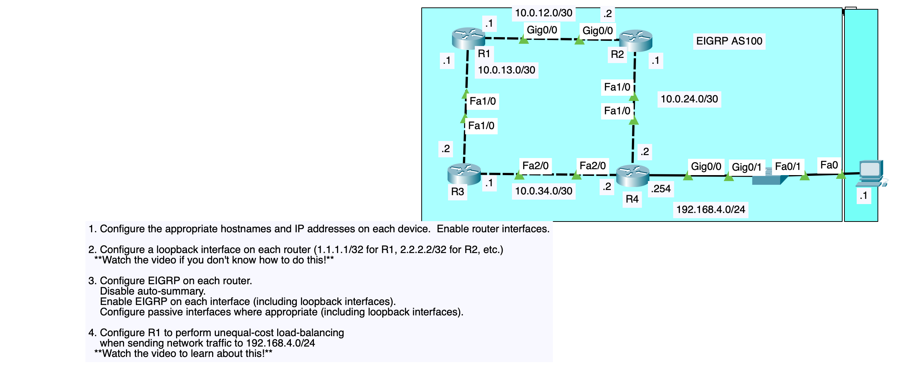

# EIGRP AS100 Lab — R1 / R2 / R3 / R4

## Topology



```
        10.0.12.0/30
   R1 .1 ---------- .2 R2
   |Gig0/0        Gig0/0|
   |                     |
Fa1/0 (10.0.13.0/30) Fa1/0 (10.0.24.0/30)
   |                     |
   R3 .1 -- Fa2/0 -- Fa2/0 -- .2 R4 --Gig0/0-- 192.168.4.0/24 -- PC
      10.0.34.0/30
```

| Router | Interface | IP Address       | Neighbor |
|--------|-----------|-------------------|----------|
| R1     | Gig0/0    | 10.0.12.1/30       | R2       |
| R1     | Fa1/0     | 10.0.13.1/30       | R3       |
| R1     | Loopback0 | 1.1.1.1/32         | —        |
| R2     | Gig0/0    | 10.0.12.2/30       | R1       |
| R2     | Fa1/0     | 10.0.24.1/30       | R4       |
| R2     | Loopback0 | 2.2.2.2/32         | —        |
| R3     | Fa1/0     | 10.0.13.2/30       | R1       |
| R3     | Fa2/0     | 10.0.34.1/30       | R4       |
| R3     | Loopback0 | 3.3.3.3/32         | —        |
| R4     | Fa1/0     | 10.0.24.2/30       | R2       |
| R4     | Fa2/0     | 10.0.34.2/30       | R3       |
| R4     | Gig0/0    | 192.168.4.254/24   | LAN/PC   |
| R4     | Loopback0 | 4.4.4.4/32         | —        |
| PC     | Fa0       | 192.168.4.1/24     | gw R4    |

## Files

- `R1.cfg`, `R2.cfg`, `R3.cfg`, `R4.cfg` — full IOS running-config style
  scripts, ready to paste into each router's CLI (or load in GNS3/EVE-NG/
  Packet Tracer via copy-paste).
- `PC.txt` — end-host IP settings.

## What each config does

1. **Hostnames + interface IPs**, all data-plane interfaces `no shutdown`.
2. **Loopback0** on every router, addressed per the `X.X.X.X/32` scheme
   (1.1.1.1 on R1, 2.2.2.2 on R2, 3.3.3.3 on R3, 4.4.4.4 on R4).
3. **EIGRP AS 100**, `no auto-summary`, every interface (incl. loopbacks)
   participates, and loopbacks are `passive-interface` so they're
   advertised but never try to form a neighbor relationship over them.
   R4's LAN interface (Gig0/0, facing the PC/switch) is also passive —
   there's no EIGRP neighbor on that segment, only a subnet to advertise.

   **Note on R1's `network` statement:** R1 uses the "match anything"
   form:
   ```
   network 0.0.0.0 255.255.255.255
   ```
   This wildcard mask matches all interfaces on the router (Gig0/0,
   Fa1/0, and Loopback0), so it's functionally equivalent to listing
   each connected /30 and the /32 loopback individually — just shorter.
   R2, R3, and R4 instead list each network explicitly with the exact
   /30 (`0.0.0.3`) or /32 (`0.0.0.0`) wildcard masks, so you can see
   both styles side by side.

4. **Unequal-cost load balancing on R1** (Task 4): R1 has two routes to
   192.168.4.0/24 — one via R2 (Gig0/0, faster) and one via R3 (Fa1/0,
   slower). By default EIGRP only installs the lowest-metric route.
   `variance 128` (under `router eigrp 100`) tells R1 to also install
   any feasible successor whose metric is within 128× the best metric,
   enabling unequal-cost load balancing across both paths. After
   applying it, verify with:
   ```
   show ip eigrp topology
   show ip route eigrp
   ```
   and tighten the variance value (e.g. 2, 4, 8) once you've confirmed
   the real metric ratio from `show ip eigrp topology`, rather than
   leaving it at the max of 128.

## Verification commands

```
show ip interface brief
show ip eigrp neighbors
show ip eigrp interfaces
show ip route eigrp
show ip protocols
show ip eigrp topology
```
